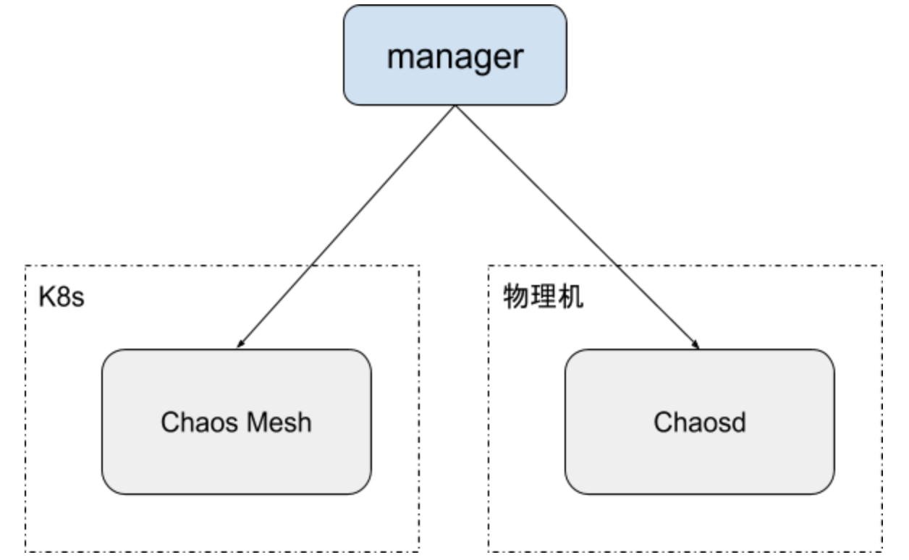

# Chaos Engineering as a Service

## Chinese Version

### 背景

目前 Chaos Mesh 功能和架构存在一定的限制，无法以统一服务的方式提供混沌工程的测试功能。

1. Chaos Mesh 只支持单个 K8s 集群的 chaos 实验调度。
2. Chaos Mesh 支持物理机（chaosd），但是不支持调度，如果需要进行支持，开发成本较高。
3. 目前还无法判断实验是否有效，需要用户查看日志或者执行命令判断。
4. 支持场景有限，如果需要新的功能需要单独开发。

### 方案

#### 架构调整

通过添加统一的 API server（manager），管理 chaos controller manager、chaosd。

- chaos controller manager、chaosd 需要定期上报自己的状态，即心跳，但不用上报数据。
- chaos controller manager 需要上报集群名称、自身存活状态，可以收到 API Server 的请求后再开始上报。
- chaosd 以 HTTP Server 形式启动，接收 chaos 实验数据。 chaosd 需要上报 hostname、访问方式、自身存活状态。
- API server 统一向 chaos controller manager、chaosd 发送 chaos 实验信息，定义以 CRD 为准。
- API server 需要添加 chaos controller manager 才会对 chaos controller manager 管理，默认不管理，添加后需要触发 chaos controller manager 的上报。
- API server 与 chaos controller manager 解耦，物理机、K8s 均可以单独使用。
- API server 后端存储可以使用 Etcd，直接复用。 不需要记录数据，只记录集群与节点组状态。 其实记录测试数据会好一点，但是开发工作量大一点。
- 也可以 API server 直接生成 CRD，但可能不太有好。 或者 Extension API Server？可能与 K8s 强绑定了。

#### 可观测性

- 正常指标监控
- 实验数据导出 metrics
- event
- node_exporter/telegraf + chaos_exporter + prometheus + grafana

参考链接：
https://github.com/litmuschaos/chaos-exporter#example-metrics

#### 支持更多场景

- HTTP Provider，定义输入与输出，支持外部 chaos
- 自定义脚本
- 自定义 job
- kata、安全容器

## English Version

To be added.